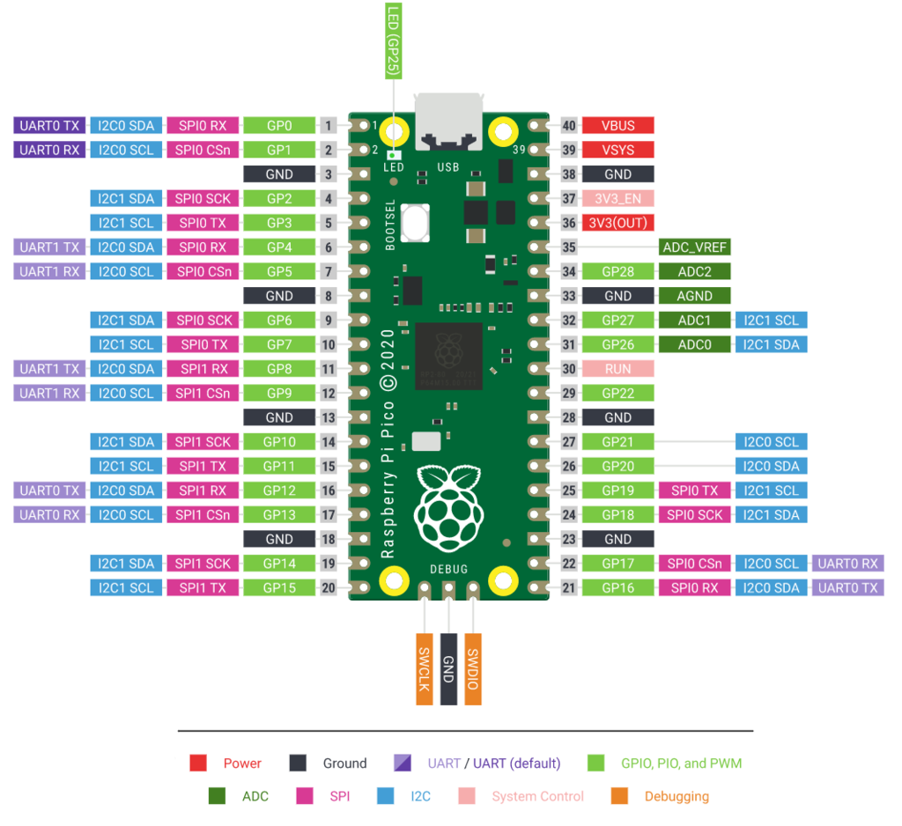

# Using a Raspberry Pi Pico to read a DS18B20 temperature sensor

This is a simple example of how to use a Raspberry Pi Pico to read a DS18B20 temperature sensor. The DS18B20 is a
digital temperature sensor that uses the 1-Wire protocol to communicate with the Raspberry Pi Pico.

It also has the necessary code to connect the Pico W to a WiFi network. Leaving the possibility of sending the data to a
remote server.

Image of the pinout for the Raspberry Pi Pico:

The above image came from the [adafruit](https://learn.adafruit.com/getting-started-with-raspberry-pi-pico-circuitpython/pinouts).

The `GND` pin of the DS18B20 sensor must be connected to the `GND` pin of the Raspberry Pi Pico. The `VCC` pin of the
DS18B20 sensor must be connected to the `3V3(OUT)` pin of the Raspberry Pi Pico. The `DATA` pin of the DS18B20 sensor
should be connected to the `GP22` pin of the Raspberry Pi Pico.

In my project, the following were used:

 - `GND` pin number 38 // `GND`
 - `VCC` pin number 36 // `3V3(OUT)`
 - `DATA` pin number 29 // `GP22`

# How to run the code on a Raspberry Pi Pico...

1. Clone the repository.
2. Make sure you've copied and edited the `secrets.py` file.
3. Use Thonny to flash MicroPython firmware to the Raspberry Pi Pico.
4. Connect the DS18B20 sensor to the Raspberry Pi Pico.
5. Copy the `main.py`, `wifi_connection.py` and `secrets.py` files to the Raspberry Pi Pico.
6. Plug the Raspberry Pi Pico into a USB plug in your house.
